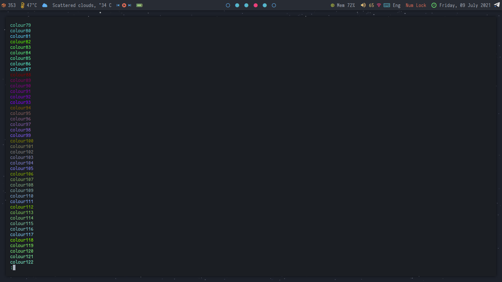
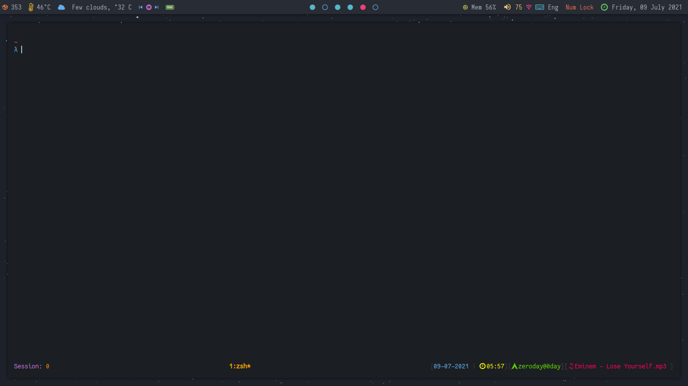
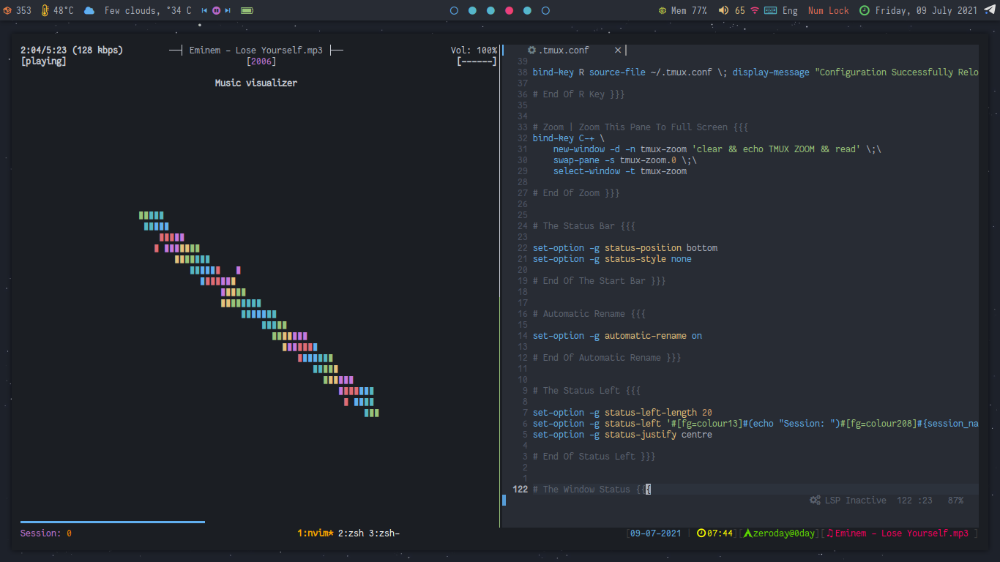
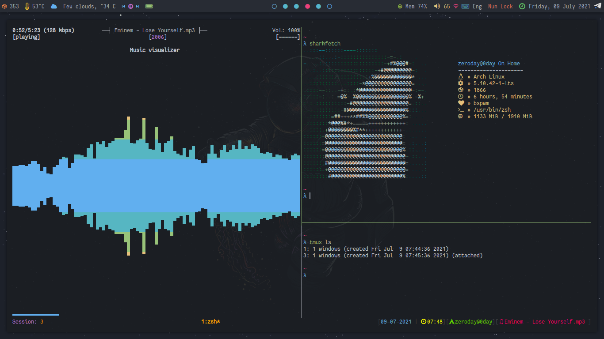

# Tmux-Configuration - Status Bar And Config For TMUX :)


## How To Find Colors?
```
git clone https://github.com/The-0Day/Tmux-Configuration.git
chmod +x Findcolors.sh 
./Findcolors.sh | less -r
```
Now You Can See the Colors (1-255)


## How Use The Config?

- After Clone This Repo, You Can Put It On Your Home Directory (~) 

- First of all you have to change the file name
```
cp tmux.conf .tmux.conf
mv .tmux.conf ~
```
Now Just Run ```tmux``` :)






